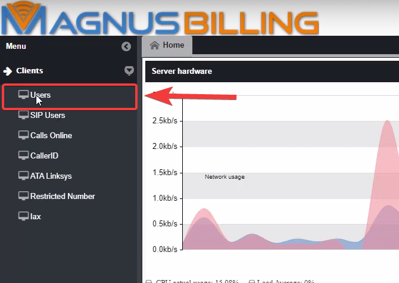
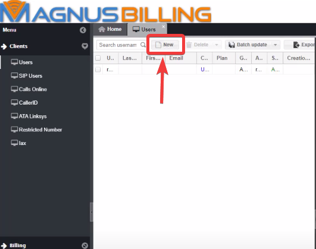
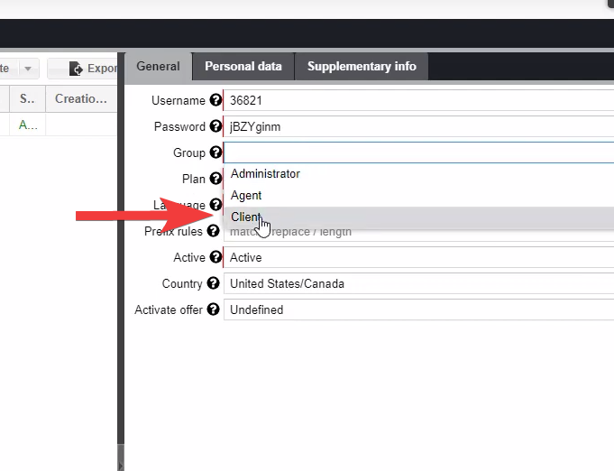
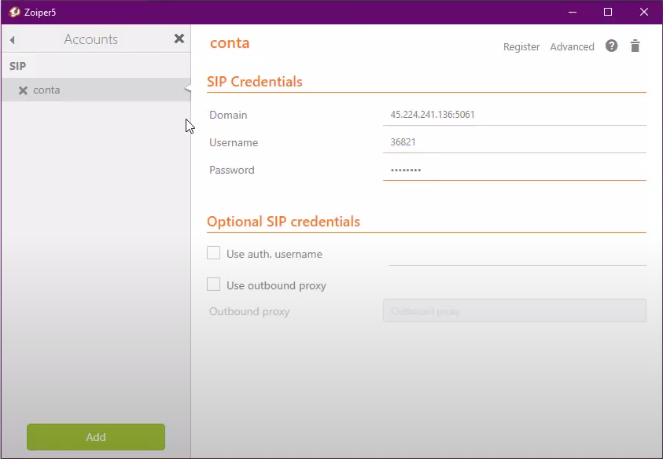

**********************
Making your first call
**********************

This will be a guide to show you how to configure MagnusBilling to make your first call.

If you prefer a guide in video form, you access this link: https://www.youtube.com/watch?v=GBm424z5KSE

Guide
^^^^^

First, you need to login to MagnusBilling, the default username and password is " root " and " magnus ". 

After loggin in, the first thing you need to do is create an User.
To do this, you need to click the Clients tab, Users, New. 

A new User will be created, the username and password will be created automatically.

Now you need to select the group of the user. In this case we are creating an client, so select the client option.

We have no plans created, so let's create one so we assign one plan to the client.
In order to do that, first click the Rates tab, Plans, New.

For this guide we will only name the plan Golden, and not change any other of the settings.

Back at the Users tab, you select the newly created plan in the search button.

.. image:: ../img/user_selectplan2.png
        :scale: 80%

After successfully  creating an user, MagnusBilling will automatically create a Sip account for this user.

Now we are going to use Zoiper software (you can use your preferred software).

In Zoiper configure the SIP credentials accordingly to the user we just created. In the domain field put your server IP address.
*Note: After the server ip (:5061) is the Asterisk Port that in this example is set up for 5061. The default MagnusBilling port is 5060. Also, since 5060 is the default SIP port, you can just use your IP address.

If the setup is done correctly, the SIP user status will change to OK.

Now we need to create a Provider. To do this, go to the Routes tab, Providers. 
You can just name it and click save. 

And after that we need to create a Trunk, fill the fields of the trunk with the credentials.
Furthermore we need to create an Trunk Group.

Lastly, we need to create an Prefix and a Tariff. Located in the Rates tab. They are pretty straight forward, so configure it to your needs.

Going to back to Zoiper. If we try to make an call, we are going to receive an warning that your balance is empty. To fix that you need to go to the Billing Tab, refills. And create a new refill to the user we created.

If everything was done correctly, you can make your first call.