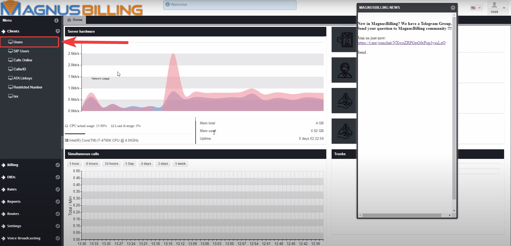

**********************
Making your first call
**********************

This will be a guide to show you how to configure MagnusBilling to make your first call.

If you prefer a guide in video form, you access this link: https://www.youtube.com/watch?v=GBm424z5KSE

Guide
^^^^^

First, you need to login to MagnusBilling, the default username and password is " root " and " magnus ". 

After loggin in, the first thing you need to do is create an User.
To do this, you need to click the Clients tab, Users, New. 

.. image:: ../img/users_newimg.png
        :scale: 80%

A new User will be created, the username and password will be created automatically.

Now you need to select the group of the user. In this case we are creating an client, so select the client option.

.. image:: ../img/users_clientimg.png
        :scale: 80%    

We have no plans created, so let's create one so we assign one plan to the client.
In order to do that, first click the Rates tab, Plans, New.

For this guide we will only name the plan Golden, and not change any other of the settings.

Back at the Users tab, you select the newly created plan in the search button.

.. image:: ../img/users_selectplan.png
        :scale: 80%

After successfully  creating an user, MagnusBilling will automatically create a Sip account for this user.

hello