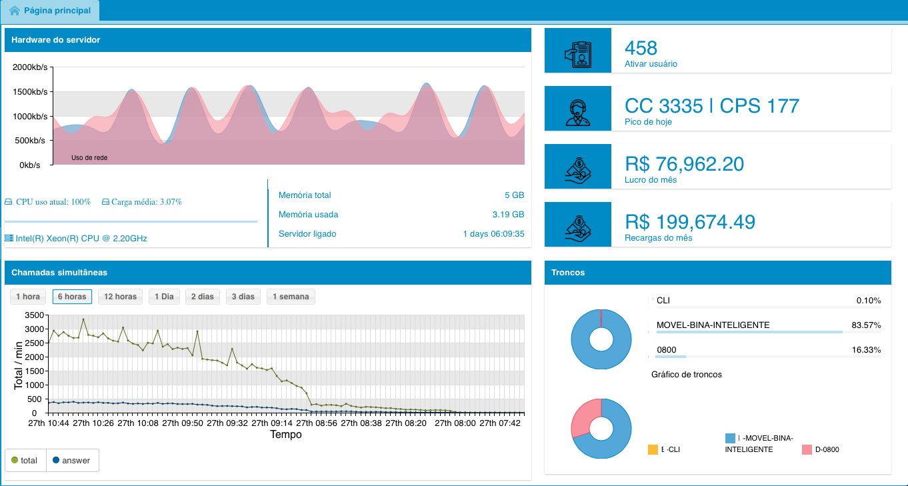

#########
Interface
#########
MagnusBilling's interface is made with ExtJS, and is composed by a lateral menu which has all the modules listed with their respective submodules.
A main area, where all the modules are opened at, with active and inactive tabs.
A suspended menu with the language options, change password, about and leave.

Monitoring Panel
^^^^^^^^^^^^^^^^^^^^^^^

In the main page we have some graphs and information about the server. This bar is only shown in the Home tab, server status bar.

	*  Processors model;
	*  Current processor usage;
	*  Average processor usage;
	*  Server total memory;
	*  Memory in use;
	*  Link upload and download usage graph;
	*  Time that the server is online;
	*  Active users;
	*  Simultaneous calls and CPS(Calls per second) peak;
	*  Profit from the month;
	*  Recharges held in the month.
	*  Simultaneous Calls graph, with the "show" option last hour, 6 hours, 12 hours, 1 day, 2 days, 3 days or 1 week;
	*  Graph of the 3 most used trunks.

	   	   

Button bar
^^^^^^^^^^^^^^^

MagnusBilling is a modular system, each menu or submenu corresponds to a module. All the modules are identical in their structure. 
Each module is composed of one bar of tools composed by this buttons:

Modules buttons bar

- Add Button.
	Adds a new record to the module.

- Edit Button.
	Edits one record, only clicking on top of a register, already open from the formulary to edit.

- Delete Button.
	Selection one or more records and clicking in Delete, will be requested the confirmation, when confirmed the record will be deleted. The delete button have a property called All, found when clicked on top of the arrow besides the button, this property deletes all the records
listed in the module. A very useful tool to delete a large amout of data.
	**OBS**: MagnusBilling databank uses InnoDB with foreign key, this links every data, therefore is not possible to delete data that are already linked with others. EX: Is not possible to delete an client, if this client made an purchase. Will be necessary to delete all the records linked to this client to be able to delete this client.

- Batch Update button.
	This button is fundamental to the server efficiency. This button is used, as the names suggests, is to update a large amount of records at the same time, making it easy one taks that would be impossible to be done manually in modules with a lot of records, with the tariff module that can easily surpass the 100 thousand records. It's use is pretty simple, search the records that you want to update and click the Batch Update button, will open a formulary with all it's fields blank, just change the fields that you want to update, letting the rest of them in blank, and then press save, this process can take a few seconds, and will update all the records.
	Batch Update button have a property called Selected, found when clicked on the arrow besides the button, this property will only update the selected records.
	

- Print button.
	This button generates a Excel file in CSV format of the selected records.

- Print button.
	This button generates a PDF file of the selected records.

- Clear Filters Button.
	This button clears used filters.

.. image:: ../img/buttons.png
        :scale: 85%	

Columns
^^^^^^^

Each columns in MagnusBilling have nemerous options, very useful for a good use of the system.

To find these options put your mouse pointer on top of the desired column, then press the arrow.

- Ascending and Descending order.
	Classifies the records of the selected column in a ascending or descending manner. This option can be used when clicked on top of the column as well.

- Columns.
	With this option you can show or hide columns, very useful to shown only necessary data. Example, to generate a price table to send to a client including only the name of destination and the sales price.
	
- Group by this Column.
	Group the records by this column, very useful for the Online Calls modules, making it possible to group the calls per client. To be able to see individually the calls of one client or any other column.

- Show in groups.
	This option is used to disable the previous option.

- Filter.
	This option is fundamental as well, therefore will be written a dedicated tutorial for it.

.. image:: ../img/colluns.png
        :scale: 85%

Filter System
^^^^^^^^^^^^^^^^^

MagnusBilling counts on a powerful filter system to find desired records in each module.

To find this option put your mouse pointer on top of the column that you want to make search, press in the arrow, slide it until Filter, will open a sub-menu containing the option for the column, keep sliding the mouse pointer unil the field and put the value that you want to search, then press enter.
OBS: The filter system is Case Sensitive.

Exists different filters depending on the type of the column;

- Text filter.

	This filter search for data in the columns with a text that begins with, ends with, contains or that is equal to. For example , if you search for the name that begins with "Peter", will be listed all the clients that have Peter in the begining of their names.

.. image:: ../img/filter_text.png
        :scale: 85%

- Whole numbers filter.

	This filter show in columns that contains numeric numbers, like the client credit column.

.. image:: ../img/filter_int.png
        :scale: 85%

- Filter by dates.

	This filter show the columns that contains dates, this filter is really useful in the reports.

.. image:: ../img/filter_date.png
        :scale: 85%

- Combo filter.

	This filter is used in cases of modules relationships.

.. image:: ../img/filter_combo.png
        :scale: 85%

 
To undo an filter, remove the selection of filter menu. And to clean all the aplicable filters in a module, click on the Clean Filters button.
