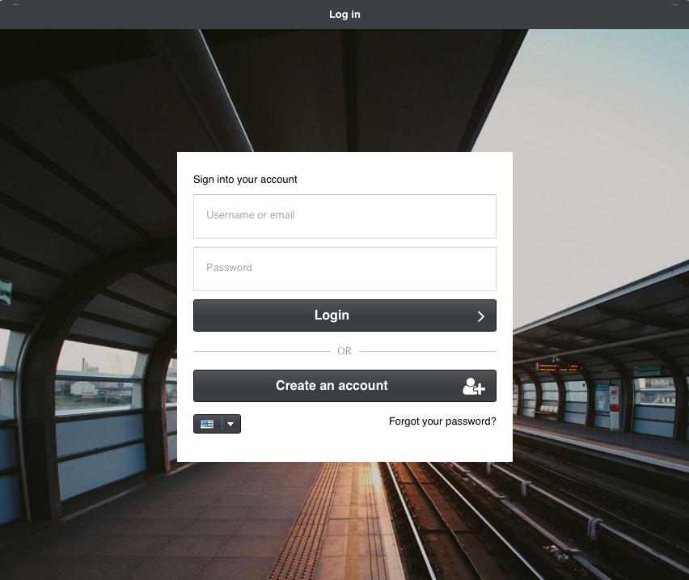

*************
Installation
*************

In order to install MagnusBilling you'll need a server with Debian , minimal install.

    
**1.** Execute the following commands as root to run the script that will install MagnusBilling, Asterisk and all dependencies needed like: IPTables, Fail2ban, Apache, PHP and MySQL.

Install Debian **minimal**.

::
     
    wget https://raw.githubusercontent.com/magnussolution/magnusbilling7/source/script/install.sh
    bash install.sh 

**2.** During the install you'll be asked what language MagnusBilling should use. Choose by typing the number of the language.

::

   Install complete. The server will restart automatically..

   Use a browser to access the interface.
      Go to: http://000.000.000.000
      User: root
      Password: magnus (Remember to change the password)

