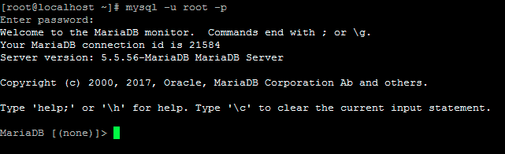

******************************
Recover Magnusbilling password
******************************

Recover MagnusBilling root password. To recover or change your root password with MagnusBilling, we will basically make some modifications directly to the MagnusBilling MySQL / MariaDB database. You can do this through the console as in this tutorial or through phpMyAdmin (in this case, you can use the same MySQL commands presented in the last steps of this tutorial).

    
**1.** JOIN AS ROOT IN THE SSH OF THE MAGNUSBILLING SERVER..

Using an SSH client, for example Putty, we enter the terminal or shell of the MagnusBilling server. We must put the IP or domain of the server and then enter root as user and its password. If you use a user other than root, login with your username, and using the sudo command, log in as root

.. image:: ../img/putty.png
        :scale: 80%

.. image:: ../img/entrar-como_root-no-terminal-SSH-root-do-Magnus-Billing.png
        :scale: 80%

**2.** ENTER AS ROOT IN MYSQL DATABASE.

Now we enter the following command:

::
     
  mysql –u root –p mbilling

By default the MagnusBilling install script saves the mysql root password in the /root/passwordMysql.log file, so you can see the mysql root password with the command

::
     
  cat /root/passwordMysql.log

**3.** MODIFY THE PASSWORD DIRECTLY IN THE DATABASE.

After entering the password, we find the MySQL monitor, where we will place the commands to change the password from the MagnusBilling admin panel and regain access. Alternatively, you can run these commands in phpMyAdmin if you have this tool on your server.

Note that MagnusBilling uses the SHA1 algorithm to encrypt the password of administrator users.

To enter a new password, since we won't know the current one as it is encrypted, we do the following.
In this example we will reset it to the default password that comes with a new installation of MagnusBilling, which is magnus. But instead, you can put whatever you want, including numbers, letters, symbols.

::
     
  UPDATE pkg_user SET password = SHA1("magnus") WHERE username = "root";

After running this command, your MagnusBilling admin password is reset, and you can log in to your dashboard normally.