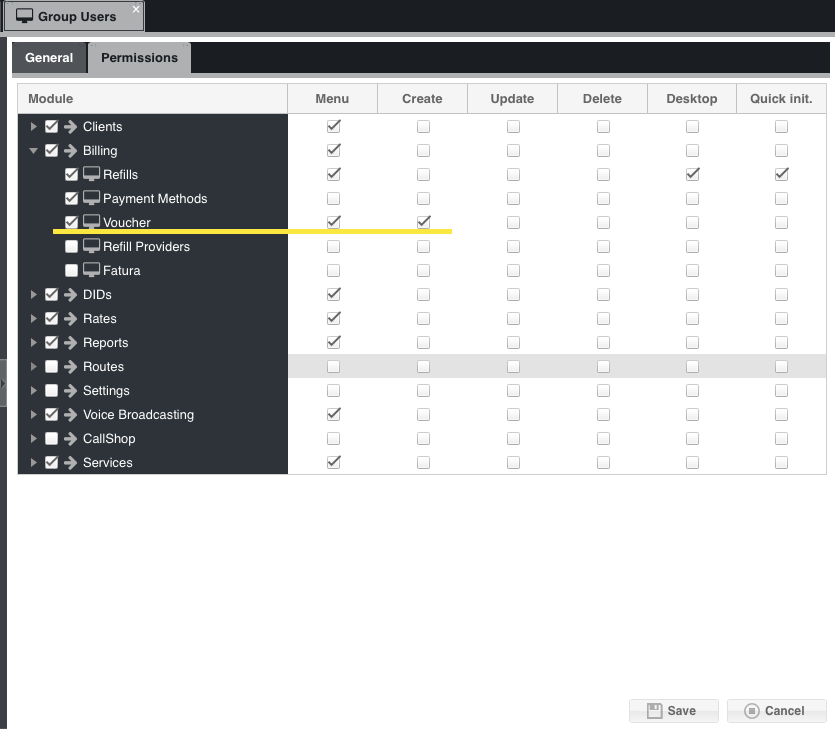

.. _how-to-use-voucher:

How to use VOUCHER
==================

To use a Voucher, the first thing to do is to create the Vouchers in the financial menu, Voucher submenu.

See the list of descriptions for each field:

* :ref:`voucher-credit` 
* :ref:`voucher-id-plan` 
* :ref:`voucher-language` 
* :ref:`voucher-prefix-local` 
* :ref:`voucher-quantity` 
* :ref:`voucher-tag` 
* :ref:`voucher-voucher`  

After generating the new Vouchers, it will be necessary to add permissions to the customer group so that they can view and create the Voucher, as shown in the image below.

There are three ways to use a voucher.

1 - Through the panel of an existing customer.

Now customers in possession of a Voucher that has not been used, and who belong to a group of customers who are allowed to view and create a Voucher, will be able to log in to their customer panel, go to the Voucher menu, click on new, and place the Voucher. Once everything is correct with the voucher, the system will release the credit to the user.

2 - Through a DID.

Create a DID and leave it without destination, or with destination Calling Card. When calling the DID, you will be asked for a PIN number, so enter the voucher number. A new user will be created, with the Voucher settings, and credit will be added to the account.

3 - Call from a SIP account to the code * 120

When calling the code * 120 and entering the Voucher number when the PIN is requested, the value of the Voucher will be added to the user.

A recharge will be created for the customer with the Voucher credit value in the 3 previous options.

In the administrator's Voucher menu, the user who used the voucher and the date of use will appear.