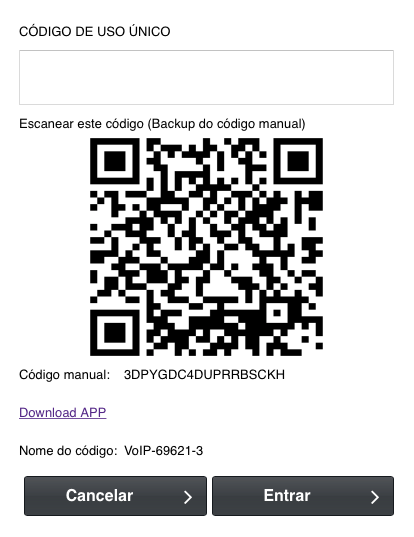

.. _gAuthenticator-username:

Username
--------

| The user that wants to activate TOKEN

.. _gAuthenticator-googleAuthenticator-enable:

Status
------

| After activating the TOKEN for the user, login will be only possible using the generated TOKEN by the Google Authenticator app.
| After activating the TOKEN, in the next user login will be requested to scan the QR CODE as shown in the image below

| To scan the code will be necessary to install the Google Authenticator app, this app will be available to download in the app store for iOS and Android.
| 
| It's important to save the manual code shown in the image, in case if you ever need to activate the token in another phone the code will be necessary.
| 
| 
| With the token of Google Authenticator will be only possible to login into the panel or deactivate the token function

.. _gAuthenticator-code:

Code
----

| The code will be necessary to deactivate the TOKEN. In case if you don't have the code anymore, will be necessary to deactivate via the database.

.. _gAuthenticator-google-authenticator-key:

Google authenticator key
------------------------

| This KEY will be necessary to activate the TOKEN in a different phone

