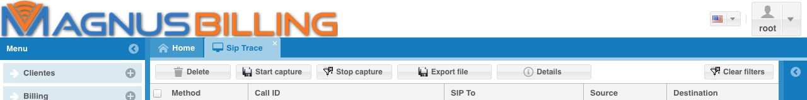
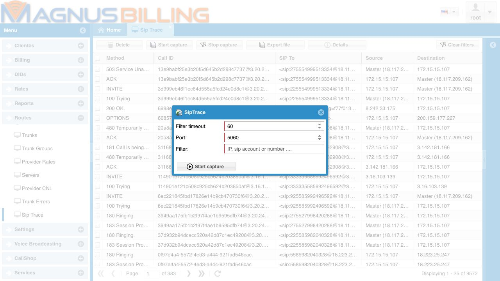

.. _sipTrace-head:

SIPTrace
========

The **SIPTrace** module allows you to capture SIP packets directly from the MagnusBilling interface to help diagnose calls, registrations, and trunk responses.

This is a paid module. To purchase it, access:

`https://magnussolution.com/services/high-availability/siptrace-en.html <https://magnussolution.com/services/high-availability/siptrace-en.html>`_

The capture is requested by the user in the panel. A background process runs ``ngrep`` with the requested data and writes the result to:

``/var/www/html/mbilling/resources/reports/siptrace.log``

When the user refreshes the module, the system reads this file and displays the captured packets in the grid.

When to use
-----------

Use SIPTrace to check, for example:

* whether a call is reaching the server;
* whether the server is sending the call to the trunk;
* which SIP response was returned by the trunk, such as ``403``, ``404``, ``480``, ``486``, ``500`` or ``503``;
* whether a ``REGISTER`` request is reaching the server;
* whether there is a difference between the inbound leg and the outbound leg of the call;
* whether a call Call-ID contains all expected packets.

Start a capture
---------------

1. Open the **SIPTrace** module.
2. Click **Start capture**.
3. Fill in the capture fields.
4. Click **Start capture** again in the filter window.
5. Wait for the configured time.
6. Click **Refresh** in the grid to view the captured packets.

While a capture is active, the system does not allow another capture to be started. Wait for the capture to finish or click **Stop capture**.

Capture fields
--------------

Filter timeout
~~~~~~~~~~~~~~

Time, in seconds, that the capture will remain active.

The value must be numeric. The minimum value is ``5`` and the maximum value is ``300``.

Port
~~~~

SIP port that will be monitored.

Usually the port is ``5060``. In installations using another SIP port, enter the corresponding port.

The value must be numeric and must be between ``1`` and ``65535``.

Filter
~~~~~~

Text used to filter the captured packets.

Common examples:

* customer IP;
* trunk IP;
* dialed number;
* SIP account;
* part of the Call-ID.

Use specific filters whenever possible. The more generic the filter is, the larger the generated file will be and the harder it will be to analyze the result.

Refresh the grid
----------------

After starting the capture, click **Refresh** to load the packets written to the ``siptrace.log`` file.

The grid displays the main information for each packet:

* **Method**: SIP method or SIP response, such as ``INVITE``, ``ACK``, ``BYE``, ``100 Trying``, ``180 Ringing`` or ``503 Service Unavailable``;
* **Call ID**: SIP identifier of the call or transaction;
* **SIP To**: destination shown in the ``To`` header;
* **Source**: packet source;
* **Destination**: packet destination;
* **Head**: full SIP packet body, used internally and also for detailed analysis.

Filter in the grid
------------------

The grid filters help you find specific packets inside the captured file.

You can filter by:

* SIP method or response;
* Call-ID;
* source IP;
* destination IP;
* ``To`` header.

To analyze a call, the best filter is usually the **Call ID**, because all packets from the same call use the same identifier.

View call details
-----------------

To open the detailed view:

1. Select one or more records in the grid.
2. Click **Details**.

The system opens a window with the packets for the selected Call-ID in a view similar to ``sngrep``.

You can select up to ``3`` records at a time. This allows you to compare calls or different legs without making the screen too heavy.

In the details screen:

* each row represents one SIP packet;
* arrows indicate the packet direction between source and destination;
* ``1xx`` and ``2xx`` responses indicate progress or success;
* ``3xx``, ``4xx``, ``5xx`` and ``6xx`` responses indicate redirection, error or rejection;
* packets with SDP show media information, such as codecs and audio IP/port;
* when you click a packet, the full SIP message body is displayed.

Export the log
--------------

Click **Export file** to download the ``siptrace.log`` file.

Use this option when you need to send the capture to support or analyze the content in another tool.

Stop a capture
--------------

Click **Stop capture** to interrupt the active capture request.

Use this option when the filter is wrong or when you do not need to wait for the configured time.

Delete the log
--------------

Click **Delete** to delete the SIPTrace log file.

This action removes the previously captured content. Before deleting it, export the file if you need to keep the analysis.

How to interpret common responses
---------------------------------

``100 Trying``
    The equipment received the ``INVITE`` and started processing the call.

``180 Ringing``
    The destination is ringing.

``183 Session Progress``
    The destination sent call progress. It may include SDP and early media.

``200 OK``
    The request was accepted. In calls, it usually means the call was answered.

``403 Forbidden``
    The call was rejected due to permission, authentication, routing or provider policy.

``404 Not Found``
    The destination or route was not found.

``480 Temporarily Unavailable``
    The destination is temporarily unavailable.

``486 Busy Here``
    The destination is busy.

``500 Server Internal Error``
    Internal error on the server or provider side.

``503 Service Unavailable``
    The service or route is unavailable. It may indicate trunk failure, limit, unavailability or a temporary provider issue.

Best practices
--------------

* Always use the most specific filter possible.
* Prefer short captures, between ``30`` and ``60`` seconds.
* For calls, filter by the dialed number or by the customer/trunk IP.
* After finding the packet in the grid, use **Details** to analyze the full Call-ID.
* Compare the inbound leg and the outbound leg of the call.
* Delete or export old logs to avoid very large files.

Limitations
-----------

SIPTrace only captures traffic that passes through the monitored interface and port. If the packet did not reach the server, it will not appear in the log.
