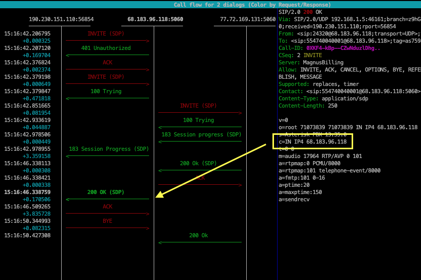
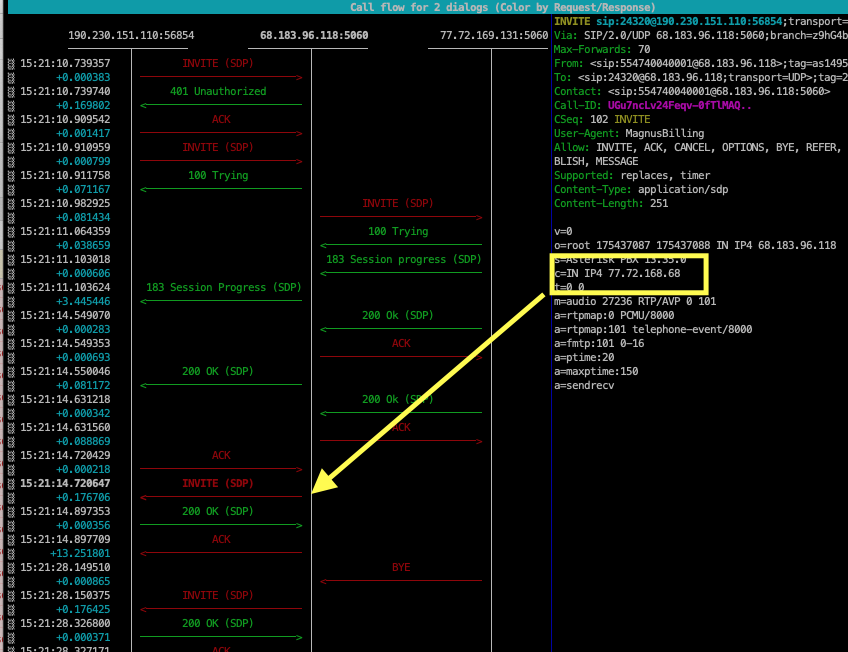
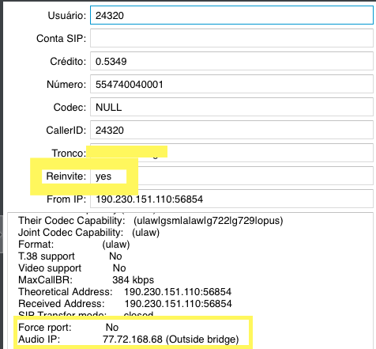

.. _asterisk-directmedia:

Directmedia
===========

Em Asterisk, a sinalização SIP para o estabelecimento de uma chamada sempre ocorre entre o servidor Asterisk e os ramais participantes desta chamada. Uma vez que a chamada foi estabelecida, o tráfego rtp também pode passar através do servidor Asterisk ou pode fluir diretamente entre os ramais participantes da chamada. 

Ambos os sistemas têm vantagens e desvantagens

* Se o tráfego rtp passa diretamente entre os ramais que participam de uma chamada, a vantagem é que o servidor Asterisk não precisa suportar essa carga, que em certos casos pode ser grande, como quando é um PBX Asterisk com dezenas ou centenas de chamadas simultaneamente.

* Se o tráfego rtp passa diretamente entre os ramais que participam de uma chamada, a desvantagem é que o Asterisk não reconhecerá nenhum código discado nos ramais assim que a chamada for iniciada. Portanto, os aplicativos do Asterisk que são ativados por certos códigos de discagem, como transferências de chamadas, não funcionarão em nenhuma circunstância.
  

Portanto, vemos que se quisermos que as transferências de chamadas e outras funções que dependem de códigos de discagem funcionem (desvios, não perturbe, gravação de chamadas, etc.) é essencial que o tráfego de voz (rtp) também passe pelo Asterisk. 

A ativação deste recurso é feita através do parâmetro directmedia no arquivo sip.conf. Com a opção directmedia = yes, o tráfego rtp flui diretamente entre as extensões que participam de uma chamada, e com a opção directmedia = no, o tráfego rtp passa pelo Asterisk. 

* A imagem a seguir mostra um exemplo prático do Asterisk com uma chamada da contas SIP 24320 com directmedia = no, ou seja, o áudio vai passar pelo Asterisk.

Veja que quando o tronco atende a chamada, o IP do RTP enviado para a origem da chamada é o próprio IP no Asterisk

A imagem é uma captura de pacotes usando um analisador de protocolo de rede, como o sngrep:

* Agora alterando a configuração da conta SIP para directmedia = yes, veja como fica na imagem abaixo.

Quando directmedia é ativado, o Asterisk gera um segundo INVITE passando no C=IN o ip do tronco, desta forma o audio passará entre a conta SIP e o tronco.

Veja no menu Chamadas online do MagnusBilling que Reenvite esta agora YES. Note também o campo Audio IP: que esta com o IP do tronco, junto com a informação (Outside bridge), tradução livre, (Ponte pelo lado de fora)

