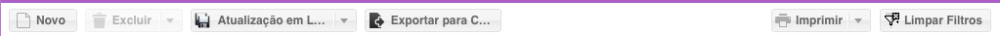
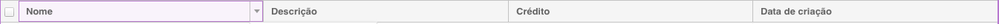
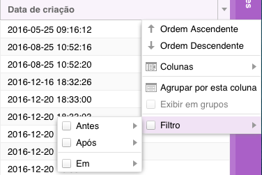
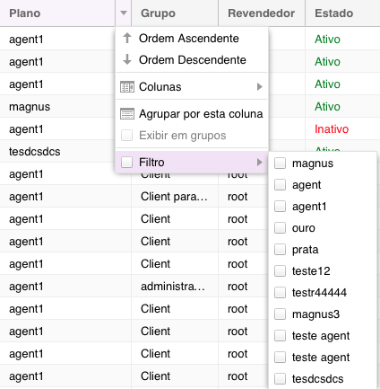

#########
Interface
#########
A interface do MagnusBilling é uma interface padrão do EXTJS, sendo formada por:
Menu lateral, contendo todos os módulos, divididos em sub módulos ordenados por categoria.
Areá principal, onde é exibidos os módulos abertos, mostrados em abas ativas e inativas.
Menu superior, com opções de idioma, botões alterar senha, ajuda e sair do sistema.

Painel de monitoramento
^^^^^^^^^^^^^^^^^^^^^^^

Na página principal, temos alguns gráficos e informações sobre o servidor. esta barra somente é mostrada na aba Home. barra de status do servidor

	*  Modelo do processador
	*  Uso atual do processador
	*  Média de uso do processador
	*  Memória total do servidor
	*  Memória em uso
	*  Gráfico do uso do link upload e download
	*  Tempo que o servidor está Up
	*  Usuários ativos
	*  Pico de chamadas simultâneas e de CPS(Chamadas por segundo)
	*  Lucro no mês
	*  Recargas realizada no mês.
	*  Gráfico de chamadas simultâneas, com opção de mostrar  ultima hora, 6 horas, 12 horas, 1 dia, 2 dias, 3 dias ou 1 semana.
	*  Gráfico dos 3 troncos mais usados.

.. image:: ../img/dashboard.png
        :scale: 85%	   
	   	   

Barra de botões
^^^^^^^^^^^^^^^

O MagnusBilling é um sistema modular, cada menu ou submenu corresponde a um módulo. Todos os módulos são idênticos em sua estrutura.
Cada módulo é composto por uma barra de ferramentas composto por estes botões:

Barra de botões dos módulos

- Botão Adicionar.
	Adicionar um novo registro ao módulo.

- Botão Editar.
	Editar um registro, somente clicando sobre um registro, já é aberto do formulário para editar.

- Botão Excluir.
	Ao selecionar um ou mais registros e clicando em Excluir, será solicitado a confirmação e sendo confirmado, será excluído o registro.
	O botão excluir tem uma propriedade chamada Todos, encontrada ao clicar sobre a flecha ao lado do botão, esta propriedade exclui todos os registros listados no módulo. Propriedade muito útil para excluir grande quantidade de dados.
	**OBS**: O banco de dados do MagnusBilling usa InnoDB com foreign key, isso relaciona todos os dados, por tanto, não é possível excluir dados que estão relacionados com outro. EX: Não é possível excluir um cliente, se este cliente tem um pagamento realizado, caso seja necessário excluir o cliente, primeiro tem que ser excluído todos os registros relacionados a este cliente.

- Botão Atualizar em Lote.
	Este botão é fundamental para uso eficiente do sistema. Este botão é usado, como sugere o nome, para atualizar vários registros ao mesmo tempo, facilitando uma tarefa que seria impossível de ser realizada manualmente em módulos com muitos registros, como o módulo tarifas que pode facilmente passar dos 100 mil registros. O uso é bastante simples, basta buscar os registros que se queira atualizar, e clicar no botão Atualizar em Lote, abrirá o formulário de edição com todos os campos em branco, altere somente os campos que queira atualizar, deixando o restante em branco, e clique em salvar, este processo pode demorar alguns segundos, e atualizará todos os registros.
	O botão Atualizar em Lote tem uma propriedade chamada Selecionados, encontrada ao clicar sobre a flecha ao lado do botão, esta propriedade irá atualizar só os registros selecionados.

- Botão Imprimir
	Este botão gera um Excel no formato CSV dos registros seleccionados.

- Botão Imprimir
	Este botão gera um PDF dos registros selecionados.

- Botão Limpar Filtros
	Este botão limpar os filtros realizados.

Colunas
^^^^^^^

Cada coluna do MagnusBilling tem várias opções muito útil para o bom uso do sistema.

Para encontrar estas opções coloque o mouse sobre a coluna desejada, e clique na flecha.

- Ordem Ascendente e Descendente.
	Classifica os registros pela coluna selecionada de forma ascendente ou descendente. Esta opção também pode ser usada clicando sobre a coluna.

- Colunas.
	Com esta opção se pode mostrar ou ocultar colunas, muito útil para mostrar somente dados necessários, exemplo, para gerar uma tabela de preço para enviar a um cliente contendo somente o nome do destino e o preço de venda.
- Agrupar por Esta Coluna.
	Agrupa os registros por esta coluna, muito útil para o módulo Chamadas Online, podendo agrupar as ligações por cliente, para poder ver separadamente as ligações de um cliente, ou de qualquer outra coluna.

- Exibir em Grupos.
	Esta opção é usada para desativar a opção anterior.

- Filtro
	Esta opção também é de fundamental entendimento, por tanto será escrito um tutorial exclusivo.

Sistema de Filtro
^^^^^^^^^^^^^^^^^

O MagnusBilling conta com um poderoso sistema de filtro para encontrar os registros desejados em cada módulo.

Para encontrar esta opção coloque o mouse sobre a coluna que deseja realizar a busca, e clique na flecha, deslizar ate Filtro, abrirá o sub-menu contendo as opções para a coluna, continue deslizando o mouse até o campo e coloque o valor que deseja buscar e aperte Enter.
OBS: O sistema de filtro é case sensitive.

Existe tipos de filtro dependendo do tipo dos dados da coluna:

- Filtro por texto.

	Este filtro encontra dados em colunas com texto que inicia com, termina com, contém ou que seja igual a. Por exemplo, buscar um cliente que tem o nome que Inicia com 'José', será listado todos os clientes que tem nome que inicia com José.

.. image:: ../img/filter_text.png
        :scale: 85%

- Filtro por números inteiros.

	Este filtro será mostrado em colunas que contêm valores numéricos, como a coluna crédito de um cliente.

.. image:: ../img/filter_int.png
        :scale: 85%

- Filtro por datas.

	Este filtro será mostrado em colunas que contêm datas, este filtro é muito útil nos relatórios.

- Filtro combo.

	Este filtro é usando em casos de relacionamento entre módulos.

 
Para desfazer um filtro, tire a seleção do menu filtro, e para limpar todos os filtros aplicado a um módulo, clique no botão Limpar Filtros.

