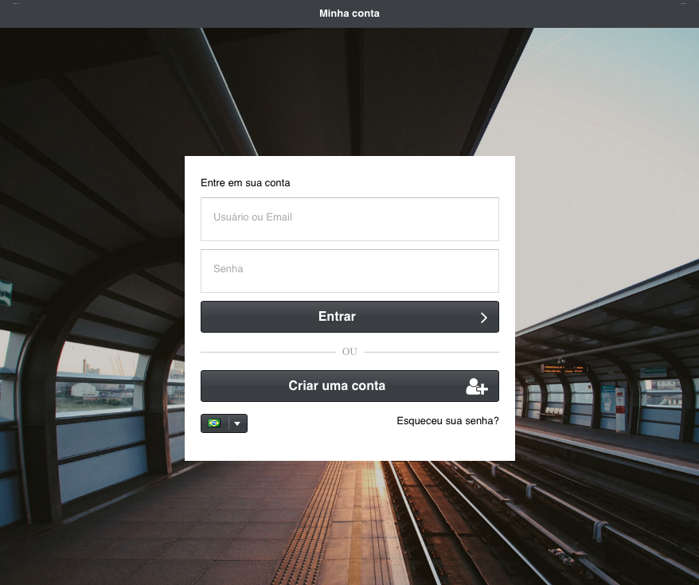

**********
Instalação
**********

Para instalar MagnusBilling, você precisa apenas de um servidor com Debian, instalação básica.

    
**1.** Execute os comandos abaixo como root. O script vai instalar Magnusbilling, Asterisk e todas as dependências necessárias, como: IPTables, Fail2ban, Apache, PHP e mysql.

Instale o Linux **minimal**.

::
     
  wget https://raw.githubusercontent.com/magnussolution/magnusbilling7/source/script/install.sh
  bash install.sh     

**2.** Durante a instalação será solicitado o idioma padrão para o Magnus Billing. Escolha digitando o número do idioma escolhido.

::

   Instalação completa. ATENÇÃO!! APÓS TERMINAR A INSTALAÇÃO, O SERVIDOR SERÁ REINICIADO AUTOMATICAMENTE!

   Use um browser para login.
      Entre em: http://000.000.000.000
      Usuário: root
      Senha: magnus (Lembre-se de alterar a senha padrão)

