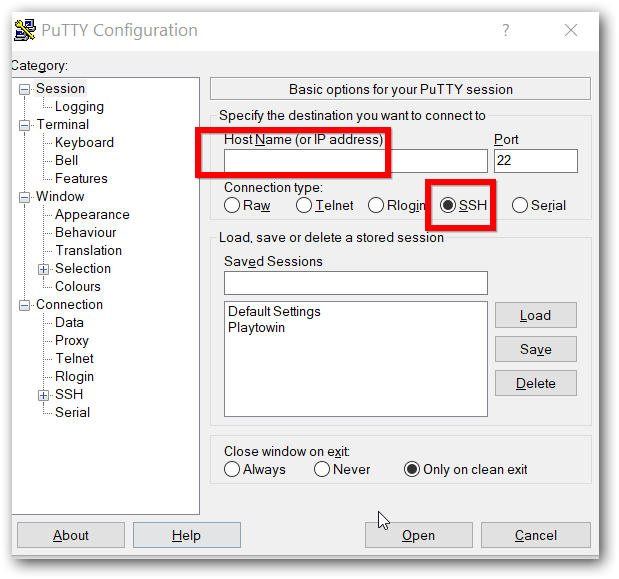
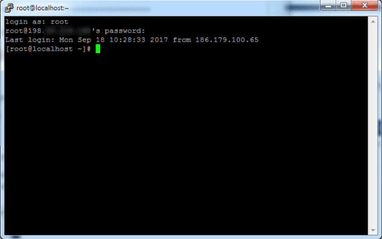

**********************************
Recuperar a senha do magnusbilling
**********************************

Recupere a senha root do MagnusBilling. Para recuperar ou alterar sua senha root com MagnusBilling, basicamente faremos algumas modificações diretamente no banco de dados do MagnusBilling MySQL / MariaDB. Você pode fazer isso por meio do console como neste tutorial ou por meio do phpMyAdmin (neste caso, você pode usar os mesmos comandos MySQL apresentados nas últimas etapas deste tutorial).

    
**1.** INGRESAR COMO ROOT NO SSH DO SERVIDOR DO MAGNUSBILLING..

Usando um cliente SSH, por exemplo Putty, entramos no terminal ou shell do servidor do MagnusBilling. Devemos colocar o IP ou domínio do servidor e depois ingressar root como usuário e a respectiva senha. Se você usar um usuário diferente do root, fazer o login com seu usuário, e usando o comando sudo, logar como root

**2.** ENTRE COMO ROOT NA BASE DE DADOS MYSQL.

Agora, inserimos o seguinte comando:

::
     
  mysql –u root –p mbilling

Por padrão o script de instalação do MagnusBilling salva a senha root do mysql no arquivo /root/passwordMysql.log, por tanto, você poderá ver a senha do root do mysql com o comando

::
     
  cat /root/passwordMysql.log 

.. image:: ../img/acesso-mysql-magnusbilling.png
        :scale: 80%

**3.** MODIFICAR A SENHA DIRETAMENTE NA BASE DE DADOS.

Depois de inserir a senha, encontramos o monitor MySQL, onde colocaremos os comandos para modificar a senha do painel de administração do MagnusBilling e recuperar o acesso. Alternativamente, você pode executar esses comandos no phpMyAdmin caso tenha essa ferramenta em seu servidor.

Observe que MagnusBilling usa o algoritmo SHA1 para criptografar a senha dos usuários administradores.

Para colocar uma nova senha, já que não vamos saber a atual, pois está criptografada, executamos o seguinte. 
Neste exemplo iremos restaurá-lo para a senha padrão que vem em uma nova instalação do MagnusBilling, que é magnus. Mas em vez disso, você pode colocar o que quiser, incluindo números, letras, símbolos.

::
     
  UPDATE pkg_user SET password = SHA1("magnus") WHERE username = "root";

Após executar este comando, sua senha de administração do MagnusBilling está resetada, e você poderá entrar no seu painel normalmente.

