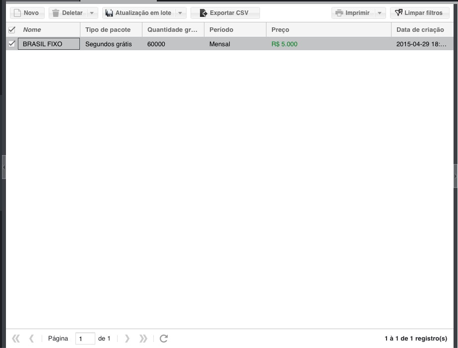
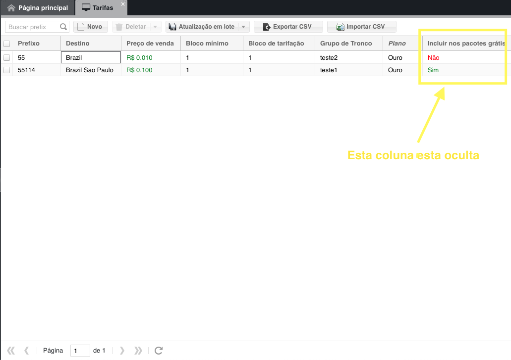
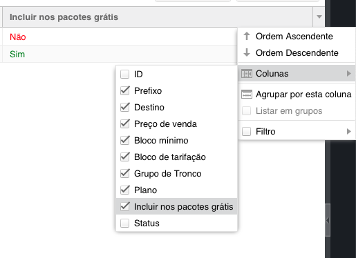
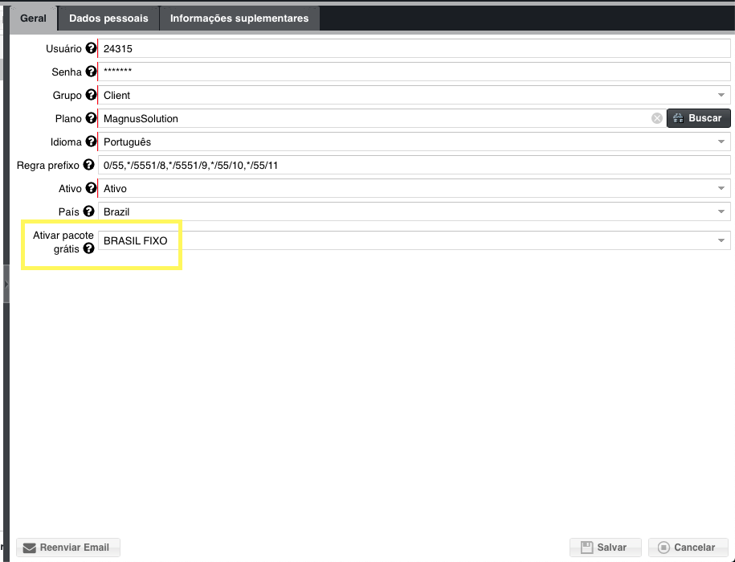
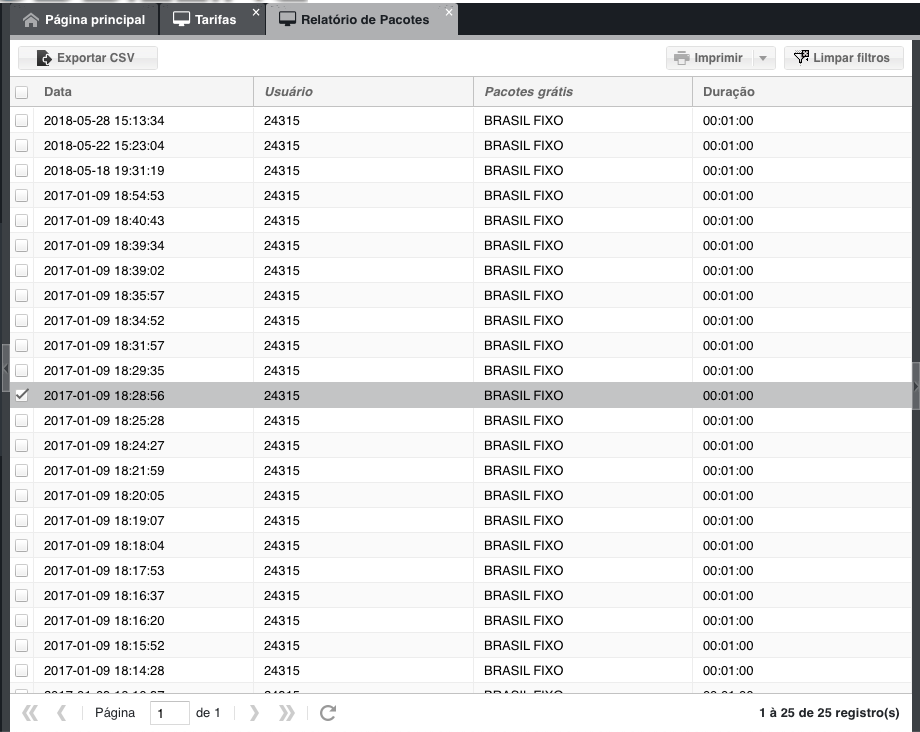
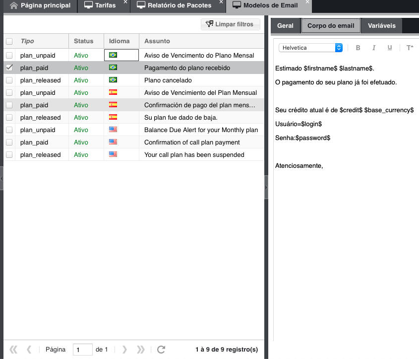

.. _offer:

Pacotes Grátis
==============

Que é pacotes grátis?
+++++++++++++++++++++

Pacotes grátis são para poder dar aos clientes um quantidade de chamadas sem custo, por um valor mensal ou sem custo algum.

Como configurar?
++++++++++++++++

A configuração dos pacotes grátis são em várias etapas

1 - Criar o pacote.

	Veja a lista das descrições de cada campo:

	* :ref:`offer-label` 
	* :ref:`offer-packagetype` 
	* :ref:`offer-freetimetocall` 
	* :ref:`offer-billingtype` 
	* :ref:`offer-price`
  

	
2 - Selecionar as tarifas que deseja incluir nos pacotes.

	É necessário informar qual serão os prefixos que serão incluídos nos pacotes grátis. Para isso, ir ao menu tarifas submenu tarifas, clicar sobre a tarifa que deseja incluir nos pacotes e colocar em sim a opção "Incluir nos pacotes grátis"

3 - Ativar os pacotes grátis para os usuários.
	Ir ao menu Clientes, submenu usuários, clicar no cliente que deseja ativar o pacote, e selecionar a opção "Ativar pacote grátis" o pacote que deseja ativar para o cliente.

Como funciona?
++++++++++++++

Usaremos o seguinte exemplo:

Foi criado um pacote gratuito chamado BRASIL FIXO, com 6000 segundos gratis, ou seja, 100 minutos, tipo de tarifação mensal e com o valor de R$5,00.

Foi configurado para incluir nos pacotes grátis as tarifas do Brasil fixo, do plano Ouro.

E foi ativado o pacote grátis no usuário 24315, e colocado este cliente no plano Ouro.

E deixamos este cliente 24315 com saldo R$10,00.

Processo realizado pelo sistema.

Cliente 24315 liga para o número 551140040001, o sistema vai verificar o plano do cliente, e logo buscará a tarifa mais adequada para o número discado, neste caso será a tarifa 55114, Fixo São Paulo.

Agora verificará se esta tarifa tem a opção "Incluir nos pacotes grátis", se sim, e no nosso exemplo esta sim, o MagnusBilling vai verificar se o cliente já realizou 100 minutos a partir do dia de ativação, considerando se o tipo de tarifação é mensal ou semana, no nosso exemplo é mensal. Se ainda não foi usado os 100 minutos, o sistema vai permitir o cliente ligar mesmo o saldo do cliente seja 0. E caso o cliente tenha saldo, a chamada será gratuita.

Caso o tarifa esteja incluída nos pacotes, mas o cliente já superou o limite do pacote, o MagnusBilling somente vai permitir a chamada se o cliente tiver crédito.

Continuando em nosso exemplo, se o cliente discar para qualquer outro numero que não inicie com 55114, somente poderá chamar se tiver crédito. Pois em nosso plano Ouro, somente selecionamos o preciso 55114 para incluir nos pacotes.

Como é cobrado o mensalidade?
+++++++++++++++++++++++++++++

Usando o mesmo exemplo anterior, e que o plano foi ativado dia 15, o sistema vai cobrar automaticamente do cliente o valor do pacote, neste exemplo R$5,00 do crédito do cliente todo dia 15.

Existe uma opção no menu configurações submenu ajustes chamado "Notificação de Pacotes de Ofertas", por padrão é 5 dias. Isso quer dizer que 5 dias antes do dia do vencimento do plano o MagnusBilling ja vai tentar cobrar o valor do pacote, neste nosso exemplo seria no dia 10.

Caso o cliente não tenha crédito suficiente para o MagnusBilling descontar os R$5,00, será enviado o email do tipo "plan_unpaid".

O magnusbilling tentará cobrar o valor do pacote grátis ate conseguir, ou até vencer o pacote. 

Caso o cliente coloque crédito, ou já tenha crédito suficiente para o pagamento, o MagnusBilling vai marcar o plano como pago mais um mês, e criar uma recarga no preço do plano, e enviará o email do tipo "plan_paid".

Caso chegue dia 16 e o cliente ainda não tenha crédito suficiente para o pagamento, será desativado o plano na conta do usuário, e enviado o email do tipo "plan_released".

Os emails poderão ser encontrados, e editados, no menu configurações submenu modelos de email.

Onde ver o consumo de cada cliente?
+++++++++++++++++++++++++++++++++++

Todas as chamadas realizadas que utilizar algum pacote, será adicionada no menu tarifas submenu relatório de pacotes.

OBS:
* Não é possível ativar mais de uma pacote por cliente.
* Não é possível criar pacotes combinados, exemplo, 100 minutos para fixo, e 50 para celular.
* Chamadas realizadas usando os pacotes sempre serão arredondadas por minutos, independente do tempo mínimo e bloco de tempo da tarifa.

Imagem do exemplo
+++++++++++++++++

Veja algumas imagens da configuraçã de nosso exemplo.

O pacote grátis.

Tarifas.

Mostrar a coluna Incluir nos pacotes grátis.

Ativação no usuário

Relatório

Modelos de Email

